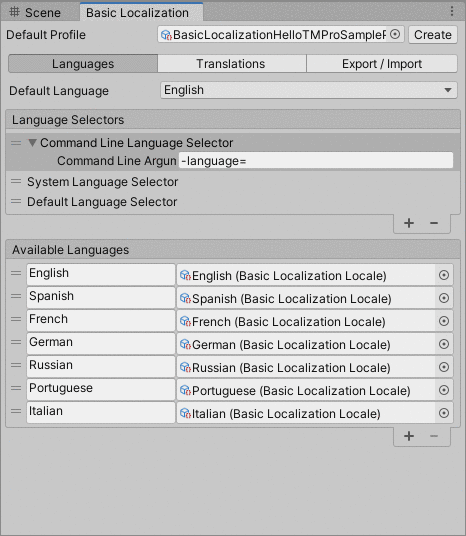

# Basic Localization

Basic Localization is a Unity package that allows you easily and quickly translate your project into different languages.

Main features:

1. Simple UI for managing translations.
2. Works best for prototypes or game jams, but it also can handle a large number of translations (10k+ entries).
3. Supports export and import from a CSV file.

Limitations:

1. The library can handle only text, not images or audio.

# Quickstart Guide

# Preview

This is preview of the main localization window. You can open it from `Window -> Basic Localization` after you've installed the package.

# Installation

The Basic Localization package can be added by adding `https://github.com/m039/BasicLocalization.git#v0.2.1` through the "Add package from git URL..." option in the Package Manager.

# Acknowledgements
Thank developers of [Lean Localization](http://carloswilkes.com/Documentation/LeanLocalization) and [Unity Localization](https://docs.unity3d.com/Packages/com.unity.localization@1.0/manual/index.html) for inspiration and some good ideas.
